# SyncLive Call Graph

This document visualizes the call paths in `BitblocksWeb.SyncLive` - the LiveView module that manages blockchain synchronization UI.

## Overview

`SyncLive` is the main LiveView for the `/sync` page.
It orchestrates three sync methods:
- **Sequential Sync** - SyncWorker (one block at a time)
- **Parallel Sync** - Sync.Pipeline (5 concurrent workers)
- **Tip Sync** - TipSyncWorker (continuous monitoring)

## Call Graph

```mermaid
graph TD
    %% Entry Points
    Mount[mount/3] --> |connected?| Subscribe[Subscribe to PubSub topics]
    Mount --> GetStatus[safe_get_status]
    Mount --> GetPipeline[safe_get_pipeline_status]
    Mount --> GetTipSync[safe_get_tip_sync_status]
    Mount --> GetChainTip[get_chain_tip]
    Mount --> GetDBCounts[get_db_counts]
    Mount --> GetSyncJobs[get_recent_sync_jobs]
    Mount --> |connected?| PollTimer["Process.send_after(:poll_tip_sync, 1000)"]

    %% Helper Functions
    GetChainTip --> RpcCache[Bitblocks.RpcCache.get_blockchain_info]
    GetDBCounts --> RepoCount1[Repo.aggregate Block :count]
    GetDBCounts --> RepoCount2[Repo.aggregate Transaction :count]
    GetSyncJobs --> RepoQuery[Repo.all SyncJob query]

    GetStatus --> |GenServer.call| SyncWorker[SyncWorker.get_status]
    GetPipeline --> |GenServer.call| Pipeline[Bitblocks.Sync.Pipeline.status]
    GetTipSync --> |GenServer.call| TipSync[TipSyncWorker.get_status]

    %% User Events - Sync Controls
    StartSync["handle_event(start_sync)"] --> BuildScope[build_scope]
    BuildScope --> |"scope_type: all"| RpcCache
    BuildScope --> |"scope_type: range"| ValidateRange[Integer.parse & validate]
    BuildScope --> |"scope_type: from_block"| ValidateTip[Integer.parse & get tip]

    StartSync --> |"sync_mode: parallel"| StartParallel[start_parallel_sync]
    StartSync --> |"sync_mode: sequential"| StartSequential[SyncWorker.start_sync]

    StartParallel --> PipelineStart[Pipeline.start_sync]

    StopSync["handle_event(stop_sync)"] --> StopWorker[SyncWorker.stop_sync]
    StopSync --> StopPipeline[Pipeline.stop_sync]

    %% User Events - Tip Sync
    StartTipSync["handle_event(start_tip_sync)"] --> TipWorkerStart[TipSyncWorker.start_sync]
    StopTipSync["handle_event(stop_tip_sync)"] --> TipWorkerStop[TipSyncWorker.stop_sync]

    %% User Events - Database Management
    ClearBlocks["handle_event(clear_blocks)"] --> DeleteBlocks[Repo.delete_all Block]
    ClearBlocks --> GetDBCounts

    ClearTx["handle_event(clear_transactions)"] --> DeleteTx[Repo.delete_all Transaction]
    ClearTx --> GetDBCounts

    %% User Events - Form Changes
    ScopeChanged["handle_event(scope_type_changed)"] --> UpdateSocket1[Update socket assigns]
    ModeChanged["handle_event(sync_mode_changed)"] --> UpdateSocket2[Update socket assigns]

    %% User Events - Transaction Queue
    QueueTx["handle_event(queue_transactions)"] --> ParseRange[Parse & validate range]
    ParseRange --> QueueRange[Chain.queue_transaction_fetch_for_range]

    %% PubSub Messages
    SyncProgress["handle_info({:sync_progress})"] --> GetStatus
    SyncProgress --> GetPipeline
    SyncProgress --> GetDBCounts
    SyncProgress --> GetSyncJobs

    PipelineProg["handle_info({:pipeline_progress})"] --> GetPipeline
    PipelineProg --> GetDBCounts

    PipelineStart2["handle_info(:pipeline_started)"] --> GetPipeline
    PipelineStop["handle_info(:pipeline_stopped)"] --> GetPipeline
    PipelineComplete["handle_info(:pipeline_completed)"] --> GetPipeline
    PipelineComplete --> GetDBCounts

    BlockError["handle_info({:block_error})"] --> GetPipeline

    %% Polling Timer
    PollTipSync["handle_info(:poll_tip_sync)"] --> GetTipSync
    PollTipSync --> GetDBCounts
    PollTipSync --> |Schedule next| PollTimer

    %% Render
    Render[render/1] --> Template[HEEx Template]
    Template --> StatusHelpers[status_class, status_text, etc.]
    Template --> FormatHelpers[format_number, format_duration, etc.]

    style Mount fill:#e1f5ff
    style Render fill:#e1f5ff
    style StartSync fill:#ffe1e1
    style StartTipSync fill:#ffe1e1
    style ClearBlocks fill:#ffe1e1
    style QueueTx fill:#ffe1e1
    style PollTipSync fill:#fff4e1
    style SyncProgress fill:#e1ffe1
```



## Key Flows

### 1. Mount Flow (Initial Load)

When the page loads:

```elixir
mount/3
├── Subscribe to PubSub ("sync_progress", "sync_pipeline")
├── safe_get_status(SyncWorker) → GenServer.call
├── safe_get_pipeline_status() → GenServer.call Pipeline
├── safe_get_tip_sync_status() → GenServer.call TipSyncWorker
├── get_chain_tip() → RpcCache.get_blockchain_info
├── get_db_counts() → Repo.aggregate
├── get_recent_sync_jobs() → Repo.all
└── Process.send_after(:poll_tip_sync, 1000)
```

### 2. User Events

#### Start Sync
```elixir
handle_event("start_sync", params)
├── build_scope(scope_type, params)
│   ├── "all" → RpcCache.get_blockchain_info (get tip)
│   ├── "range" → Integer.parse + validate
│   └── "from_block" → Integer.parse + get tip
└── Case sync_mode:
    ├── "parallel" → Pipeline.start_sync(start, end)
    └── "sequential" → SyncWorker.start_sync({start, end})
```

#### Tip Sync Controls
```elixir
handle_event("start_tip_sync")
└── TipSyncWorker.start_sync()

handle_event("stop_tip_sync")
└── TipSyncWorker.stop_sync()
```

#### Database Management
```elixir
handle_event("clear_blocks")
├── Repo.delete_all(Block)
└── get_db_counts() → update socket

handle_event("clear_transactions")
├── Repo.delete_all(Transaction)
└── get_db_counts() → update socket
```

#### Queue Transaction Downloads
```elixir
handle_event("queue_transactions", %{"tx_start_block" => ..., "tx_end_block" => ...})
├── Integer.parse + validate range
└── Chain.queue_transaction_fetch_for_range(start, end)
```

### 3. Real-time Updates

#### PubSub Messages (from SyncWorker, Pipeline)
```elixir
handle_info({:sync_progress, progress})
├── safe_get_status(SyncWorker)
├── safe_get_pipeline_status()
├── get_db_counts()
└── get_recent_sync_jobs()

handle_info({:pipeline_progress, _})
├── safe_get_pipeline_status()
└── get_db_counts()

handle_info(:pipeline_started | :pipeline_stopped | :pipeline_completed)
├── safe_get_pipeline_status()
└── get_db_counts() (if completed)
```

#### Polling Timer (Tip Sync only)
```elixir
handle_info(:poll_tip_sync)
├── safe_get_tip_sync_status() → GenServer.call TipSyncWorker
├── get_db_counts()
└── Process.send_after(:poll_tip_sync, 1000) (schedule next)
```

## Data Flow

### Status Queries

All status functions use `try/catch` to handle GenServer errors gracefully:

```elixir
safe_get_status(SyncWorker)
├── GenServer.call(SyncWorker, :get_status, 30_000)
└── Returns: %{status, blocks_synced, total_blocks, current_block, errors_count}

safe_get_pipeline_status()
├── GenServer.call(Pipeline, :status, 30_000)
└── Returns: %{status, start_height, end_height, current_height, blocks_processed, progress_percent, errors_count}

safe_get_tip_sync_status()
├── GenServer.call(TipSyncWorker, :get_status)
└── Returns: %{status, last_synced_height, current_tip, blocks_synced}
```

### Database Queries

```elixir
get_chain_tip()
└── RpcCache.get_blockchain_info()
    └── Returns: %{blocks, headers, synced, verification_progress}

get_db_counts()
├── Repo.aggregate(Block, :count, :id)
├── Repo.aggregate(Transaction, :count, :id)
└── Returns: {blocks_count, transactions_count}

get_recent_sync_jobs()
└── Repo.all(from s in SyncJob, order_by: [desc: s.started_at], limit: 10)
```

## Communication Patterns

### PubSub Topics

| Topic | Subscriber | Publisher | Message |
|-------|-----------|-----------|---------|
| `"sync_progress"` | SyncLive | SyncWorker | `{:sync_progress, progress}` |
| `"sync_pipeline"` | SyncLive | Sync.Pipeline | `{:pipeline_progress, _}`, `:pipeline_started`, `:pipeline_stopped`, `:pipeline_completed`, `{:block_error, height, error}` |

### Polling (replaces PubSub for TipSync)

- **Interval:** 1 second
- **Message:** `:poll_tip_sync` (self-sent)
- **Action:** Query TipSyncWorker.get_status() directly

## Helper Functions

### Formatting Helpers

```elixir
format_number/1           # Adds commas: 1000000 → "1,000,000"
format_block_duration/1   # Formats ms: 1500 → "1.5s"
format_datetime/1         # Formats: DateTime → "2025-01-15 10:30:00 UTC"
format_duration/1         # Formats job duration: "2h 15m 30s"
```

### Status Helpers

```elixir
status_class/1            # Returns CSS class for status badge
status_text/1             # Returns human-readable status text
scope_description/1       # Describes sync scope: "Blocks 0 to 100"
progress_percent/1        # Calculates percentage: 50/100 → 50.0
```

## File Location

- **Module:** `BitblocksWeb.SyncLive`
- **File:** `lib/bitblocks_web/live/sync_live.ex`
- **Route:** `/sync`
- **Template:** Inline HEEx (~H""" ... """)

## Related Modules

- `Bitblocks.SyncWorker` - Sequential sync (one block at a time)
- `Bitblocks.Sync.Pipeline` - Parallel sync (5 workers)
- `Bitblocks.TipSyncWorker` - Continuous tip monitoring (10 concurrent tasks)
- `Bitblocks.Chain` - Database operations
- `Bitblocks.RpcCache` - Bitcoin RPC calls
